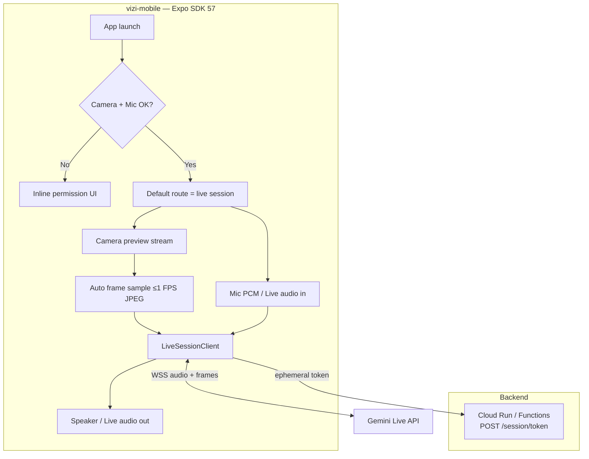
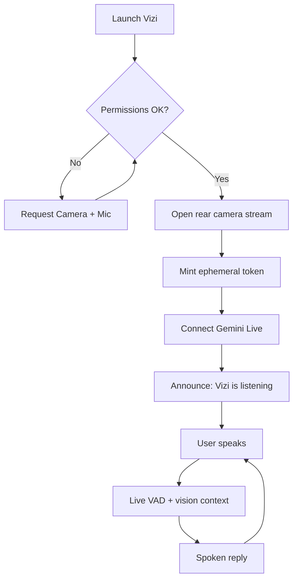
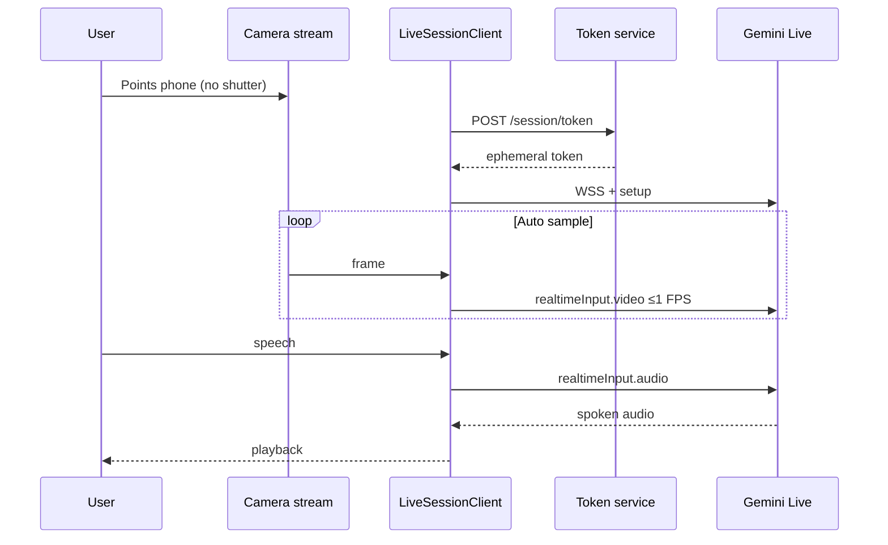

# Vizi — Technical Specification (Expo)

**Version:** 2.0  
**Status:** Implementation-ready for hackathon MVP  
**Platforms:** iOS + Android  
**App root:** [`vizi-mobile/`](./vizi-mobile/)  
**Product requirements:** [`PRD.md`](./PRD.md)

### Changelog

| Ver | Change |
|---|---|
| 2.0.1 | Paths: `vizi-asets` → `vizi-assets`; note Poppins body + Chunk brand; note missing `eas.json`. |
| 2.0 | Aligned to scaffolded `vizi-mobile/` (Expo SDK 57), single root PRD, removed Start gate / Deepgram / stale paths. |
| 1.x | Prior drafts (Gemini Live, native STT/TTS fallback, on-device Phase 3 plan, Mermaid diagrams). |

---

## 1. Purpose

Implement Vizi as an Expo app that **opens the rear camera on launch**, continuously observes the live stream (no manual photos), accepts natural speech, and returns spoken answers in under ~2 seconds.

Product flow (PRD §5 / §11): **Launch → Live camera → User speaks → Gemini Live answers → continue**.

---

## 2. Repo layout

```
vizi/
├── PRD.md                 # Product requirements (source of truth)
├── TECH_SPEC.md           # This file
├── AGENTS.md              # Agent onboarding
├── README.md              # Human setup / runbook
├── skills-lock.json       # Expo skills lockfile
├── .agents/skills/        # Installed Expo / EAS agent skills
├── vizi-assets/            # Design tokens, fonts, Apple/Firebase notes (secrets gitignored)
└── vizi-mobile/           # Expo app (implement here)
    ├── app.json
    ├── package.json
    ├── assets/
    └── src/
        ├── app/           # Expo Router (routes only)
        ├── components/
        ├── features/
        ├── lib/
        └── theme/
```

**Rules**

- Do **not** recreate a second `PRD.md` under `vizi-mobile/`.
- Follow existing `vizi-mobile/` conventions (`src/app`, kebab-case components). Do not restructure to match generic Expo templates.
- Agent skills: prefer project `.agents/skills/*` for Expo/EAS procedures.

---

## 3. Product scope (MVP)

### In scope

| Capability | Notes |
|---|---|
| Launch → camera immediately | No Home / Start gate (PRD §5) |
| Continuous live-stream vision | Auto-sample frames; **never** user shutter |
| Voice conversation | Listen, answer, barge-in |
| Scene / object / color / OCR / safety context | Via Gemini |
| Accessibility | Large targets, high contrast, voice-first |
| Ephemeral media | No durable image/audio storage by default |

### Out of scope (MVP)

- Navigation / smart glasses / face ID / medication / currency
- Fully on-device VLM as primary path (see §9)
- Family / emergency modes
- Heavy account onboarding (anonymous / light auth OK)

### Explicit non-goals

- **No “Tap Start”** on the happy path  
- **No Take Photo** UI or `ImagePicker` in the session path  
- **No Deepgram**

---

## 4. Architecture

### 4.1 Primary: Gemini Live end-to-end



**Voice:** Gemini Live native audio in/out.  
**Fallback (only if Live audio fails):** OS STT (`expo-speech-recognition`) → Gemini Vision text → OS TTS (`expo-speech`).

### 4.2 Camera streaming model

| Concern | Decision |
|---|---|
| Entry | Launch → camera session |
| Capture | Continuous rear **video stream** |
| AI input | Auto-sample from stream; throttle ≤1 FPS to Gemini Live |
| Scaffold today | `expo-camera` preview (already in app) |
| Target for robust sampling | Prefer **VisionCamera** frame processors when wiring Live (dev client required either way for Firebase native modules) |
| Never | User shutter / photo library writes as the vision path |

### 4.3 System diagrams

#### Launch & conversation



#### Realtime media loop



---

## 5. Current scaffold vs target

| Area | In repo now | MVP target |
|---|---|---|
| Package | `vizi-mobile`, Expo `~57.0.11` | Keep |
| Router | `src/app/index.tsx` + `_layout.tsx` | Keep; index = session |
| Camera UI | `expo-camera` preview + **Start** button stub | **Remove Start**; auto-start listening/Live |
| Theme | Cream `#F2EAE0`; **Chunk** brand + **Poppins** body | Keep (`vizi-assets/design`) |
| EAS | No `eas.json` yet | Add when creating dev/production builds (`expo-dev-client` skill) |
| Firebase / Purchases | Stub modules + RN Firebase plugins | Wire as needed for auth/analytics/Plus |
| Gemini Live | Not wired | Core milestone |
| Speech packages | Usage strings present; libs TBD | `expo-audio` + Live; fallback speech pkgs |

**UI bug to fix first when building:** `HomeScreen` still shows a Start button — contradicts PRD/tech spec. Replace with auto session + status chrome (Mute / Repeat / Reconnect).

---

## 6. App structure (implement in `vizi-mobile/`)

```
vizi-mobile/src/
├── app/
│   ├── _layout.tsx          # fonts, providers, a11y
│   └── index.tsx            # live session (default route)
├── components/              # rounded-button, screen, camera-frame…
├── features/
│   ├── camera/              # preview + auto sampler
│   ├── session/             # LiveSessionClient, state machine
│   ├── audio/               # mic / playback / barge-in
│   └── a11y/
├── lib/
│   ├── api/                 # token client
│   ├── gemini/              # WS helpers + prompts
│   ├── firebase.ts
│   └── purchases.ts
└── theme/
```

Optional later: `app/permissions` only if inline permission UI is insufficient.

---

## 7. Session design

1. On mount: ensure permissions → start camera preview immediately.  
2. `POST /session/token` → open Gemini Live WSS.  
3. Setup: Vizi system prompt, AUDIO response, VAD on, optional transcriptions for captions.  
4. Stream mic + auto-sampled JPEGs (≤1 FPS, longest edge ~768–1280, quality ~0.65).  
5. Barge-in: flush playback on user speech.  
6. Background: pause streams; foreground: auto-resume unless user ended.  
7. Discard frames/audio from memory after send/play — no durable store.

### Media formats

| Stream | Format |
|---|---|
| Mic → Live | PCM s16le 16 kHz mono |
| Live → speaker | PCM s16le 24 kHz mono |
| Camera → Live | JPEG ≤1 FPS from live stream |

---

## 8. Backend

### `POST /session/token`

- Holds Google API key server-side  
- Returns ephemeral token, `wsUrl`, model id, `expiresAt`  
- Rate limit per device / anonymous UID  
- Inject system prompt / Live constraints when supported  

Deploy: Cloud Run or Cloud Functions. Optional Firebase Anonymous Auth.

---

## 9. On-device models (Phase 3 — not MVP)

Full local VLM replacement is possible later (ExecuTorch / LiteRT-LM + native STT/TTS) but **not** the hackathon default.

To enable a clean swap later, implement a `VisionCompanion` interface in MVP:

```ts
interface VisionCompanion {
  prepare(): Promise<void>;
  startSession(): Promise<void>;
  pushFrame(jpeg: Uint8Array): void;
  stopSession(): Promise<void>;
}
```

- MVP: `GeminiLiveCompanion`  
- Later: `OnDeviceCompanion`  
- Flag: `EXPO_PUBLIC_COMPANION=live|ondevice|hybrid`

Local path is turn-based (STT → VLM → TTS), not Gemini duplex audio. See prior notes: model download (0.5–4 GB), RAM floor, safety eval before cutting over street-crossing.

---

## 10. Accessibility & design

- Brand palette from `vizi-assets/design/colors.md` / `src/theme/colors.ts`  
- Typography: **Chunk** for brand/titles; **Poppins** for body/button/caption (`@expo-google-fonts/poppins`)  
- Large controls, WCAG AA contrast on overlays  
- VoiceOver / TalkBack: announce “Vizi is listening” on session ready  
- Dynamic Type / font scale respected  
- Prefer spoken status over toast-only errors  

---

## 11. Business hooks (PRD §13)

| Tier | Notes |
|---|---|
| Free | Limited usage |
| Plus `$7.99/mo` | `react-native-purchases` already stubbed |
| Venue / Employer / Agency / City | Backend + admin later — not MVP UI |

MVP may ship without paywall; keep Purchases module isolated.

---

## 12. Security & privacy

- No durable frames/audio by default  
- Ephemeral Gemini tokens only in the client  
- TLS everywhere  
- Never commit: `.p8`, Firebase admin JSON, `GoogleService-Info.plist`, `.env*` (see root `.gitignore`)  
- Do not paste secrets into markdown under `vizi-assets/`  

---

## 13. Implementation phases

| Phase | Work |
|---|---|
| A | Fix launch UX (remove Start); permission + listening status |
| B | Auto frame sampler from live stream |
| C | Token service + Gemini Live audio/video |
| D | Barge-in, reconnect, a11y pass, demo rehearsal |
| E (optional) | Native STT/TTS fallback; Purchases / Plus |

---

## 14. Success criteria

- [ ] Cold launch opens live camera + listening (no Start) on iOS and Android  
- [ ] Vision from live stream only (no user photos)  
- [ ] Median spoken reply &lt; 2s on demo network  
- [ ] Four PRD demo scenarios work in-session  
- [ ] No durable media writes  
- [ ] VoiceOver/TalkBack: launch → ask → hear  

---

## 15. Mapping PRD → implementation

| PRD | Implementation |
|---|---|
| Launch → camera | `vizi-mobile` default route = session |
| Expo iOS + Android | Expo SDK 57 + EAS dev builds |
| Gemini Live | Primary multimodal session |
| Deepgram | Removed |
| Cloud Run / Firebase / Functions | Token service + optional Auth/Analytics |
| Offline AI (roadmap) | §9 on-device path |
| Market / Plus | Purchases stub; paywall post-MVP OK |
